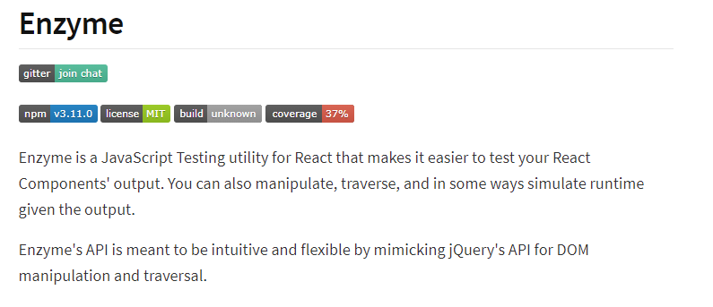

# :classical_building: LYRICSEUM - The LyricsFinder Application  

## :dart: Introduction

This is a simple web application created by using React.js and Musixmatch Developer API. 

With this app, you can easily find the lyrics of any song you want and also this shows you the essential data such as **Artist Name**, **Song Genre**, **Availability of the Explicit Words** and **Release Date** of your favorite song.

### Front Page

### Lyrics Page

* React
* Musixmatch Developer API
* CORS Anywhere: Node JS proxy
* Firebase Hosting

## :chart_with_upwards_trend: Trello - Project Management Dashboard
:point_right: [Trello Link](https://trello.com/b/Uq3h43I8/lyricseum-web-application)  

## :flying_saucer: CI/CD with Github Actions
1. Deployed Front End into Firebase Hosting Service with Githhub Actions Pipeline.
2. Build and deployed Node.js proxy into Heroku.  

## :test_tube: Unit Testing
* Jest - An open-source testing framework built on JavaScript.
* Enzyme - A JavaScript Testing utility for React.

### Scripts:
  

